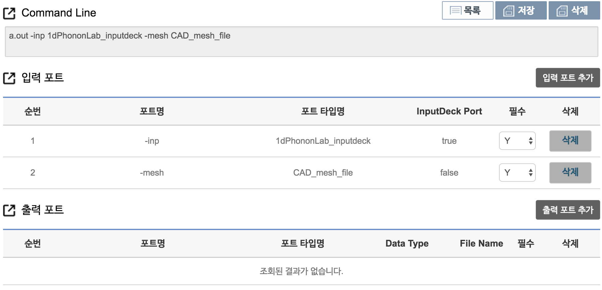
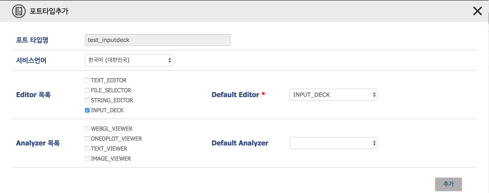

# EDISON 입출력 프로그래밍 방법

EDISON 플랫폼을 활용하여 웹 기반 시뮬레이션 서비스를 하기 위해서는 EDISON에서 정의한 입출력 형식을 준수해야 한다. 
- 시뮬레이션 SW의 실행 방식은 **./[실행 파일 명] [커맨드 옵션] [인풋 파일의 절대 경로]** 형태로 실행 
  -  ex) ./a.out –inp /home/user1/data/input.dat
  - 소스코드에서 **[인풋 파일의 절대경로]** 처리를 위해 파일 경로 버퍼에 저장하는 경우, 버퍼 공간을 512byte 잡아야 함
- 결과 파일은 실행 파일 디렉토리에 result 폴더를 생성하여 그 안에 저장해야 함

다음과 같이 프로그래밍 된 시뮬레이션 SW는 EDISON 플랫폼에서 서비스 될 수 없다.
 - 입력 파일을 입력 받지 않고 특정 위치의 특정 이름인 입력 파일만 읽는 경우
 - 사용자 키 입력을 통해 입력 파일의 이름이나 위치를 입력 받는 경우
   - C언어의 **scanf()** 함수, python의 **input()** 함수 등을 통해 입력 파일 값을 받는 경우 
 - 결과 파일을 **result** 폴더가 아닌 다른 폴더에 결과 파일을 생성하는 경우

### 입력 프로그래밍

EDISON에서 시뮬레이션 SW 실행 시 1개 이상의 파일을 입력 받을 수 있고, 이를 구분하기 위해 각각 다른 커맨드 옵션(포트 명)을 통해 입력 파일을 받을 수 있도록 프로그래밍 되어야 한다. 

#### Case 1. 입력 파일이 1개인 경우  

본 예제는 실행 파일이 **a.out**이며, 커맨드 옵션(포트 명)이 "-inp"인 입력 파일을 읽어와 path 정보를 출력하는 코드이다.

 - 리눅스 상에서 실행 커맨드 예 ::  
   - **./a.out -inp /home/user1/data/sample1.dat** 


예제에 맞게 작성된 입력 포트 정보는 아래 그림과 같다.  


##### FORTRAN Code example

```fortran
      program sample1

      CHARACTER(len=16) :: cmd_option_name
      CHARACTER(len=512) :: inputdeck
      INTEGER :: num_of_args, i
      LOGICAL :: args_error_flag = .false.

      num_of_args = iargc()

      do i=1, num_of_args, 2
            call getarg(i,cmd_option_name)

            if( cmd_option_name .eq. "-inp") then
                  call getarg(i+1,inputdeck)
            else
                  args_error_flag = .true.
                  write (*,*) "ERROR: INVALID COMAND OPTION: " ,
     +            cmd_option_name
            endif
      enddo

      if ( args_error_flag .eqv. .true. ) then
            write (*,*) "CHECK YOUR COMAND OPTION"
            stop
      endif

      write (*,*) "Input file path : ", inputdeck

      end program

```
######주요 변수 설명 
 - ```cmd_option_name``` : 커맨드 옵션(포트 명)을 저장하는 크기가 16인 character형 배열로 선언
 - ```inputdeck``` : 입력 파일의 path를 저장하는 배열로 크기는 512인 characcter형 배열을 선언
 - ```num_of_args``` : 실행 시 같이 입력된 argument의 개수를 저장하는 변수 
 - ```args_error_flag = .false.``` : 커맨드 옵션(포트 명)이 잘못 입력된 경우, 이 변수의 값을 ```.true.```로 변경


######주요 코드 설명

```fortran
      ...
[1]   num_of_args = iargc()
      ...
```
 1. [iargc()](https://gcc.gnu.org/onlinedocs/gfortran/IARGC.html) 함수를 이용하여 입력된 argument의 개수를 num_of_args 변수에 저장 

```fortran
      ...
[1]   do i=1, num_of_args, 2   
[2]         call getarg(i,cmd_option_name)

[3]         if( cmd_option_name .eq. "-inp") then
                  call getarg(i+1,inputdeck)
[4]         else
                  args_error_flag = .true.
                  write (*,*) "ERROR: INVALID COMAND OPTION: " ,
     +            cmd_option_name
            endif
      enddo
      ...
```
1. do loop를 이용해 num_of_args 개수 까지 i 값을 2씩 증가하면서 loop 문 수행
  - 예제에서 [iargc()](https://gcc.gnu.org/onlinedocs/gfortran/IARGC.html) 함수로 받은 값이 2 이므로 loop문이 한번만 수행 됨 
2. [getarg()](https://gcc.gnu.org/onlinedocs/gfortran/GETARG.html#GETARG) 함수를 이용해 i번째 arument 값을 ```cmd_option_name``` 변수에 저장
3. 저장한 ```cmd_option_name``` 값이 **-inp**와 같은지 확인하여 같으면, i+1번째 arument 값을 읽어서 ```inputdeck``` 배열에 저장
4. ```cmd_option_name``` 값이 **-inp**와 다르면, ```args_error_flag``` 를 ```.false.```로 변경하고 잘못 입력한 커맨드 옵션을 출력


#### Case 2. 입력 파일이 2개인 경우  

본 예제는 실행 파일이 **a.out**이며, 커맨드 옵션(포트 명)이 "-inp"인 입력 파일과, "-mesh"인 입력 파일을 읽어와 path 정보를 출력하는 코드이다.

 - 리눅스 상에서 실행 커맨드 예 ::  
   - **./a.out -inp /home/user1/data/sample.inp -mesh /home/user1/data/sample.mesh** 


예제에 맞게 작성된 입력 포트 정보는 아래 그림과 같다.  





##### FORTRAN Code example

```fortran
      program sample

      CHARACTER(len=16) :: cmd_option_name
      CHARACTER(len=512) :: inputdeck, inputmesh
      INTEGER :: num_of_args, i
      LOGICAL :: args_error_flag = .false.

      num_of_args = iargc()

      do i=1, num_of_args, 2
            call getarg(i,cmd_option_name)

            if( cmd_option_name .eq. "-inp") then
                  call getarg(i+1,inputdeck)
            else if ( cmd_option_name .eq. "-mesh") then
                  call getarg(i+1,inputmesh)
            else
                  args_error_flag = .true.
                  WRITE (*,*) "ERROR: INVALID COMAND OPTION: " ,
     +            cmd_option_name
            endif
      enddo

      if ( args_error_flag .eqv. .true. ) then
            WRITE(*,*) "CHECK YOUR COMAND OPTION"
            stop
      endif

      inputdeck=trim(inputdeck)
      inputmesh=trim(inputmesh)

      write (*,*) "Input file path : ", inputdeck
      write (*,*) "Input file path : ", inputmesh


      end program

```
######주요 변수 설명 
 - ```cmd_option_name``` : 커맨드 옵션(포트 명)을 저장하는 크기가 16인 character형 배열로 선언
 - ```inputdeck``` : 입력 파일의 path를 저장하는 배열로 크기는 512인 characcter형 배열을 선언
 - ```num_of_args``` : 실행 시 같이 입력된 argument의 개수를 저장하는 변수 
 - ```args_error_flag = .false.``` : 커맨드 옵션(포트 명)이 잘못 입력된 경우, 이 변수의 값을 ```.true.```로 변경


######주요 코드 설명

```fortran
      ...
      num_of_args = iargc()
      ...
```
 - [iargc()](https://gcc.gnu.org/onlinedocs/gfortran/IARGC.html) 함수를 이용하여 입력된 argument의 개수를 ```num_of_args``` 변수에 저장 

```fortran
      ...
[1]   do i=1, num_of_args, 2   
[2]         call getarg(i,cmd_option_name)

[3]         if( cmd_option_name .eq. "-inp") then
                  call getarg(i+1,inputdeck)
[4]         else if ( cmd_option_name .eq. "-mesh") then
                  call getarg(i+1,inputmesh)
[5]         else
                  args_error_flag = .true.
                  write (*,*) "ERROR: INVALID COMAND OPTION: " ,
     +            cmd_option_name
            endif
      enddo
      ...
```
1. do loop를 이용해 num_of_args 개수 까지 i 값을 2씩 증가하면서 loop 문 수행
  - 예제에서 [iargc()](https://gcc.gnu.org/onlinedocs/gfortran/IARGC.html) 함수로 받은 값이 4 이므로 loop문이 두번 수행 됨 
2. [getarg()](https://gcc.gnu.org/onlinedocs/gfortran/GETARG.html#GETARG) 함수를 이용해 i번째 arument 값을 ```cmd_option_name``` 변수에 저장
3. 저장한 ```cmd_option_name```  값이 **-inp**와 같은지 확인하여 같으면, i+1번째 arument 값을 읽어서 ```inputdeck``` 배열에 저장. 
4. 저장한 ```cmd_option_name```  값이 **-mesh**와 같은지 확인하여 같으면, i+1번째 arument 값을 읽어서 ```inputmesh``` 배열에 저장
5. ```cmd_option_name``` 값이 **-inp**와 **-mesh** 같지 않으면, ```args_error_flag``` 를 ```.false.```로 변경하고 잘못 입력한 커맨드 옵션을 출력


#### Case 3. Inputdeck을 입력 파일로 사용하는 경우  

EDISON 플랫폼에서는 Inputdeck 이라는 기능을 제공하여, 시뮬레이션 수행에 필요한 변수 값, 문자열, 벡터등의 데이터를 웹에서 바로 입력할 수 있는 기능을 제공하고 있다. 


Inputdeck를 자신의 시뮬레이션 SW에 활용하고 싶다면, Inputdeck에서 생성되는 입력 파일을 읽을 수 있도록 프로그램을 작성해야 한다.
Inputdeck 작성 시 입력 파일을 생성하는 규칙을 정할 수 있으며, 이 규칙에 따라 생성된 입력 파일을 읽어 올 수 있으면 된다.
프로그램 작성 시 유의 사항은 다음과 같다.
- Inputdeck 생성 규칙에 맞게 변수 값을 읽어와야 함
- Inputdeck 데이터의 생성 순서에 상관 없이도 동작해야 함
- 원하는 변수 값들이 정상적으로 입력되지 않았다면 에러 메시지를 발생 시켜야 함 

**사이언스 앱스토어 > 앱 관리 > 앱 생성 > 입/출력 포트 정보 ** 에서 신규 포트 생성 시 Editor 목록에서 **INPUT_DECK**을 선택하고 **추가** 버튼을 누르면 Inputdeck을 Editor로 사용하는 인풋 포트를 생성할 수 있다


이후 Inputdeck 정의 화면을 통해 변수와 벡터가 생성되는 규칙을 설정 할 수 있다. 

 
 
  - ```value delimiter``` : 변수 이름과 변수 값을 구분해 주는 기호를 설정하는 부분이다. ```EQUAL```과 ```SPACE```를 선택할 수 있다.
  - ```Line delimiter ``` : 하나의 변수가 종료 됨을 알려주는 문자를 선택할 수 있다. 기본적으로 변수간에 자동 줄바꿈이 들어가 있으며, ```SEMICOLON```, ```COLON```, ```NULL``` 중에 하나를 선택할 수 있다.
  - ```Comment Char``` : 입력 파일에 주석 처리를 하고자 하는 경우 주석 문의 시작 문자를 설정
  - ```Vector bracket``` : 벡터 변수 사용시 괄호의 종류를 선택할 수 있다. ```SQUARE```, ```ROUND```, ```SQUARE_SPACE```, ```ROUND_SPACE``` 선택 가능하며 ```_SPACE```가 붙은 경우에는 괄호와 벡터 원소 사이에 space가 들어가 있는 상태로 생성된다.
 - ```Vector Delimiter``` : 벡터 원소간 구분해 주는 기호를 설정 ```COMMA```와 ```SPACE``` 중에 하나를 설정할 수 있다. 


 
 
 
 
 
 
 
 
 
 
 
 
 
 
 
 