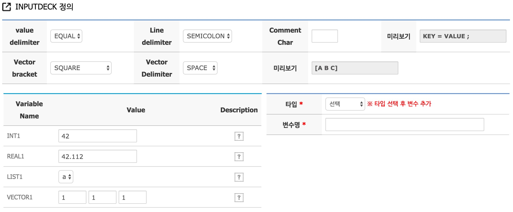

# C example


### Inputdeck case study 1

다음과 같이 정수형 변수 1개, 실수형 변수 1개, 리스트형 변수 1개, 3차원 벡터 1개를 받는 Inputdeck를 생성하였다. 


Inputdeck에서 필요한 정보들만 담기 위해 Inputdeck 설정 값을 다음과 같이 정하였다. 

| INPUTDECK key | value |
| -- | -- |
| value delimiter | SPACE |
| line delimiter | NULL |
| Vector vracket | SQUARE_SPACE |
| Vector delimiter | SPACE |

이렇게 설정되어 생성된 입력 파일은 다음과 같다.

```
INT1 42
REAL1 42.112
LIST1 a
VECTOR1 [ 1 0 0 ]
```


####Code example
```c
#include <stdio.h>
#include <stdlib.h>
#include <string.h>

int main (int argc, char* argv[])
{
      FILE *fp_inputdeck ;
      int count;
      char args_error_flag = 0;
      char buf_char[256];

      int int1;
      double real1;
      char list1;
      int vector1[3];

      if (argc > 1) {
            for (count = 1; count < argc; count+=2) {
                  if(!strcmp(argv[count],"-inp")) {
                        printf("-inp : %s \n", argv[count+1]);
                        fp_inputdeck = fopen(argv[count+1], "r");
                        if (fp_inputdeck == NULL) {
                              printf("Error opening %s file. path : %s \n",argv[count], argv[count+1]);
                              exit(1);
                        }
                  } else {
                        printf("Invalid command option: %s\n", argv[count] );
                        args_error_flag = 1;
                  }
            }
            if(args_error_flag == 1) {
                  printf("Check your comand option\n");
                  exit(1);
            }
      } else {
            printf("Invalid arguments number.\n");
            exit(1);
      }

      while(1)
      {
            fscanf(fp_inputdeck,"%s", buf_char);
            if(feof(fp_inputdeck))
                  break;

            if(!strcmp(buf_char, "INT1")) {
                  fscanf(fp_inputdeck, "%d", &int1);
            } else if (!strcmp(buf_char, "REAL1")) {
                  fscanf(fp_inputdeck, "%lf", &real1);
            } else if (!strcmp(buf_char, "LIST1")) {
                  fscanf(fp_inputdeck, "%s", &list1);
            } else if (!strcmp(buf_char, "VECTOR1")) {
                  fscanf(fp_inputdeck, "%*s %d %d %d %*s", &vector1[0], &vector1[1], &vector1[2]);
            } else {
                  printf("Error Invalid value name :: %s\n", buf_char);
                  exit(1);
            }
      }

      printf("int1: %d \n", int1);
      printf("real1: %f \n", real1);
      printf("list1: %c \n", list1);
      printf("vector1 =  %d %d %d \n",vector1[0], vector1[1], vector1[2]);


      fclose(fp_inputdeck);

      return 0;
}

```
[입력 파일이 1개인 경우의 C 예제 코드](input/input_c.md)에서 Inputdeck 파일을 읽는 부분을 추가한 예제이다. 


#####주요 변수 설명 

- ```int1```, ```real1```, ```list1```, ```vector[3]``` : Inputdeck 파일에서 각각의 변수 값를 저장하는 변수
- ```buf_char[256]``` : 입력된 인풋덱 파일에서 변수 이름을 저장하는 배열

#####주요 코드 설명

```c
...
[1]   while(1)
      {
[2]         fscanf(fp_inputdeck,"%s", buf_char);
[3]         if(feof(fp_inputdeck))
                  break;

[4]         if(!strcmp(buf_char, "INT1")) {
                  fscanf(fp_inputdeck, "%d", &int1);
            } else if (!strcmp(buf_char, "REAL1")) {
                  fscanf(fp_inputdeck, "%lf", &real1);
            } else if (!strcmp(buf_char, "LIST1")) {
                  fscanf(fp_inputdeck, "%s", &list1);
            } else if (!strcmp(buf_char, "VECTOR1")) {
                  fscanf(fp_inputdeck, "%*s %d %d %d %*s", &vector[0], &vector[1], &vector[2]);
[5]         } else {
                  printf("Error Invalid value name :: %s\n", buf_char);
                  exit(1);
            }
      }
...
```

1. ```while``` 문을 이용해 파일을 처음부터 끝까지 읽는다. 
2. [fscanf()](http://www.cplusplus.com/reference/cstdio/fscanf/?kw=fscanf) 함수를 이용해 변수 이름이 저장되어 있는 하나의 문자열(첫 단어)를 ```buf_char```에 저장한다. 
3. [feof()](http://www.cplusplus.com/reference/cstdio/feof/) 함수를 이용해 파일의 끝까지 읽으면 ```break``` 문을 이용해 ```while```문을 빠져 나온다.
4. 입력 파일에서 읽은 변수 이름을 확인하여 저장 함. 벡터 변수의 경우 변수 이름과 값 사이에 있는 ```[``` 문자를 처리하기 위해 ```%*s``` 를 사용하여 파일에서 ```[``` , ```]``` 변수는 읽기만 하고 따로 변수에 저장하지 않는다. 
5. 원하지 않은 변수 값이 입력되는 경우 이에 대한 에러 메시지를 표시하고 프로그램을 종료

[예제 다운 받기](../code/c/case3.c)

### Inputdeck case study 2

다음과 같이 정수형 변수 1개, 실수형 변수 1개, 리스트형 변수 1개, 3차원 벡터 1개를 받는 Inputdeck를 생성하였다. 



Inputdeck에서 필요한 정보들만 담기 위해 Inputdeck 설정 값을 다음과 같이 정하였다. 

| INPUTDECK key | value |
| -- | -- |
| value delimiter | EQUAL |
| line delimiter | SEMICOLON |
| Vector vracket | SQUARE_SPACE |
| Vector delimiter | SPACE |

이렇게 설정되어 생성된 인풋 파일은 다음과 같다.

```
INT1 = 42 ;
REAL1 = 42.112 ;
LIST1 = a ;
VECTOR1 = [ 1 0 0 ] ;
```


####Code example
다음과 같이 생성된 입력 파일을 읽어와 같은 이름의 변수를 생성해 저장하는 코드이다. case 1의 코드와 크게 다르지 않으며, ```%*s``` 이용해 변수 이름과 변수 값 사이에 있는 ```=``` 와 변수 끝에 있는 ```;```을 파일에서 읽기만 하고, 따로 저장하지 않는 부분을 추가하였다. 

```c
#include <stdio.h>
#include <stdlib.h>

int main (int argc, char* argv[])
{
      FILE *fp_inputdeck ;
      int count;
      char args_error_flag = 0;
      char buf_char[256];

      int int1;
      double real1;
      char list1;
      int vector1[3];
      if (argc > 1) {
            for (count = 1; count < argc; count+=2) {
                  if(!strcmp(argv[count],"-inp")) {
                        printf("-inp : %s \n", argv[count+1]);
                        fp_inputdeck = fopen(argv[count+1], "r");
                        if (fp_inputdeck == NULL) {
                              printf("Error opening %s file. path : %s \n",argv[count], argv[count+1]);
                              exit(1);
                        }                        
                  } else {
                        printf("Invalid command option: %s\n", argv[count] );
                        args_error_flag = 1;
                  };
            }
            if(args_error_flag == 1) {
                  printf("Check your comand option\n");
                  exit(1);
            }
      } else {
            printf("Invalid arguments number.\n");
            exit(1);
      }

      while(1)
      {
            fscanf(fp_inputdeck,"%s", buf_char);
            if(feof(fp_inputdeck))
                  break;

            if(!strcmp(buf_char, "INT1")) {
                  fscanf(fp_inputdeck, "%*s %d %*s", &int1);
            } else if (!strcmp(buf_char, "REAL1")) {
                  fscanf(fp_inputdeck, "%*s %lf %*s", &real1);
            } else if (!strcmp(buf_char, "LIST1")) {
                  fscanf(fp_inputdeck, "%*s %s %*s", &list1);
            } else if (!strcmp(buf_char, "VECTOR1")) {
                  fscanf(fp_inputdeck, "%*s %*s %d %d %d %*s %*s", &vector1[0], &vector1[1], &vector1[2]);
            } else {
                  printf("Error Invalid value name :: %s\n", buf_char);
                  exit(1);
            }
      }

      printf("int1: %d \n", int1);
      printf("real1: %f \n", real1);
      printf("list1: %c \n", list1);
      printf("vector1 = %d %d %d \n",vector1[0], vector1[1], vector1[2]);


      fclose(fp_inputdeck);

      return 0;
}
     
```


