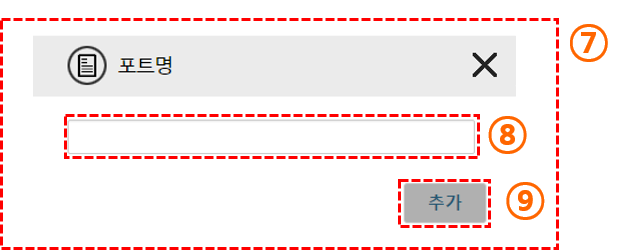
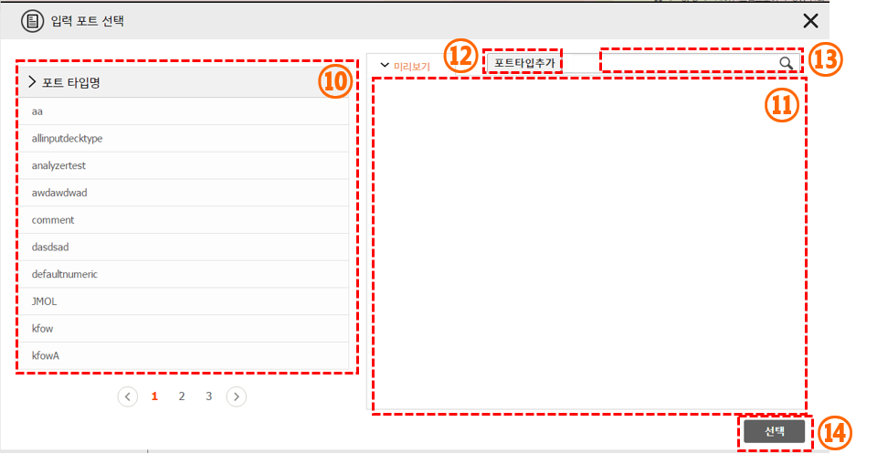
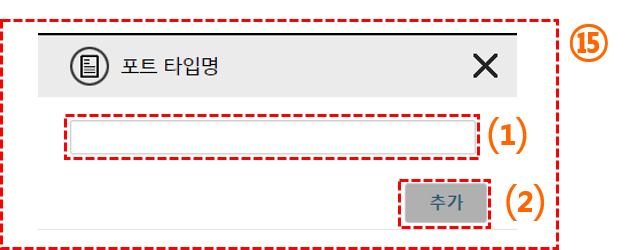
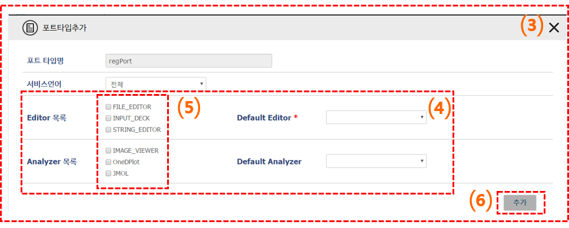

#입출력 포트 정보 생성

입력 포트 추가와 출력 포트 추가 버튼을 누르면 다음과 같이 포트 명을 입력하는 창이 뜬다. 입력 포트의 경우 해당 입력 파일의 커멘드 옵션을 넣어주면 된다.

(7) 입력 또는 출력 포트 추가 버튼(③, ⑤)을 누르면 나타나는 포트의 이름을 입력하는 팝업 창입니다.

(8) 포트의 이름을 입력 부분 입니다.

(9) 추가 버튼을 누르면 포트선택 창으로 이동합니다.

 - 입력/출력 포트명은 현재 앱에서 정의된 포트명과 중복 될 수 없습니다.

### 입출력 포트 선택
포트명을 입력하면 포트 타입을 검색할 수 있는 화면으로 이동한다. 기존의 생성된 포트 타입을 등록하는 경우 검색 창을 이용해 선택하면 되며, 없는 경우 포트 타입추가 버튼을 이용해 포트 타입을 추가한다.

(10) 등록된 포트타입 목록을 조회 할 수 있습니다.

(11) 각 포트타입을 클릭 시 포트타입을 조회 할 수 있습니다.

(12) 포트타입추가 버튼 클릭 시 포트타입을 추가하는 창으로 이동 합니다.

(13) 포트타입 명을 입력하여 포트타입을 검색을 할 수 있습니다.

(14) 선택버튼을 클릭 하면 선택한 포트타입이 입/출력 포트에 등록이 됩니다.

 - 입력포트 등록 시 InputDeck Editor를 사용 하는 포트는 하나 이상을 선택 할 수 없습니다.

###입출력 포트 생성

입출력 포트 생성 버튼을 클릭하면 다음과 같이 포트 타입명을 입력하는 창이 뜬다. 생성하고자 하는 포트의 데이터 타입에 맞도록 포트 타입명을 생성하고 추가 버튼을 누르면 된다.

(15) 포트타입추가 버튼을(⑫) 클릭하면 포트타입의 이름을 작성 하는 창입니다.

(1) 포트타입의 이름을 작성하는 부분입니다.

(2) 포트타입 추가 창으로 이동하는 버튼 입니다.

 -  포트타입 명은 기존 등록된 포트 타입명과 중복 될 수 없습니다.

포트 타입 추가시 해당 데이터 타입의 Editor와 Analyzer를 선택할 수 있습니다. 여러개를 선택할 수 있으며, Default 값을 설정 할 수 있습니다.  입력 포트를 설정하는 경우 새로 생성된 포트가 에디터를 필수로 가져야 하며, 출력 포트를 설정하는 경우 새로 생성된 포트가 Analyzer를 필수로 가지고 이써야 합니다.

Editor 목록
 - FILE_EDITOR : 파일을 업로드 하는 경우 해당 에디터를 선택합니다.
 - INPUT_DECK : 변수등의 입력 환경을 웹 UI으로 제공하고자 하는 경우 해당 에디터를 선택합니다. 해당 에디터를 체크한 이후 추가 버튼을 누르면 인풋덱 편집 화면으로 이동합니다.
 - String_editor : 한줄 정도의 데이터 입력을 받는 경우 해당 에디터를 선택합니다. 이 경우 인풋 옵션 뒤에 입력 파일의 경로 대신 입력한 스트링 값이 입력 됩니다.
 - TEXT_EDITOR : 메모장 형태의 파일을 직접 작성할 수 있는 에디터 환경을 제공합니다. 해당 에디터로 텍스트를 입력한 뒤 저장을 하면, 텍스트 파일로 저장 되며, 이를 바로 입력파일로 사용할 수 있습니다.

Analyzer 목록
 - WEBGL_Viewer : 파일이 HTML등의 웹 문서인 경우 해당 뷰어를 선택
 - ONEDPLOT_Viewer : 1차원 그래프를 표시해주는 뷰어, 파일이 oneD 인 경우 이 뷰어를 선택
 - TEXT_Viewer : 텍스트 파일을 보여주는 뷰어
 - Image_Viewer : 이비지 파일을 보여주는 뷰어

